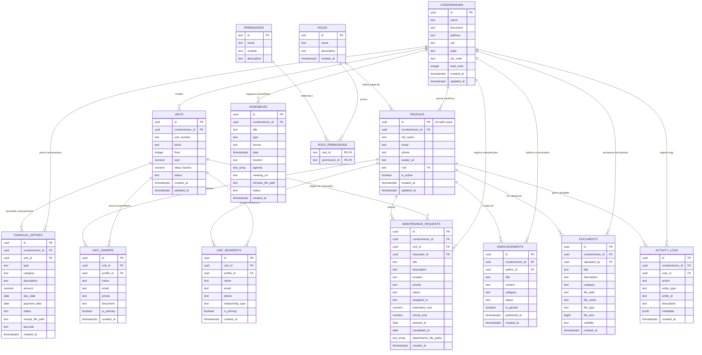

# Diagrama de Relacionamento de Entidades (ERD)

**Sistema:** Plataforma de Gestão Condominial  
**Formato:** Mermaid Entity-Relationship Model  

```mermaid
erDiagram
    CONDOMINIUMS ||--o{ PROFILES : "possui membros"
    CONDOMINIUMS ||--o{ UNITS : "contém"
    CONDOMINIUMS ||--o{ FINANCIAL_ENTRIES : "possui lançamentos"
    CONDOMINIUMS ||--o{ MAINTENANCE_REQUESTS : "registra manutenções"
    CONDOMINIUMS ||--o{ ANNOUNCEMENTS : "publica comunicados"
    CONDOMINIUMS ||--o{ DOCUMENTS : "armazena documentos"
    CONDOMINIUMS ||--o{ ASSEMBLIES : "organiza assembleias"
    CONDOMINIUMS ||--o{ ACTIVITY_LOGS : "registra logs"

    ROLES ||--o{ ROLE_PERMISSIONS : "possui"
    PERMISSIONS ||--o{ ROLE_PERMISSIONS : "atribuída a"
    ROLES ||--o{ PROFILES : "define papel de"

    UNITS ||--o{ UNIT_OWNERS : "possui proprietários"
    UNITS ||--o{ UNIT_RESIDENTS : "possui moradores"
    UNITS ||--o{ FINANCIAL_ENTRIES : "vinculada a lançamentos"
    UNITS ||--o{ MAINTENANCE_REQUESTS : "origem de chamados"

    PROFILES ||--o{ UNIT_OWNERS : "é proprietário"
    PROFILES ||--o{ UNIT_RESIDENTS : "é morador"
    PROFILES ||--o{ MAINTENANCE_REQUESTS : "solicita"
    PROFILES ||--o{ ANNOUNCEMENTS : "é autor de"
    PROFILES ||--o{ DOCUMENTS : "fez upload de"
    PROFILES ||--o{ ACTIVITY_LOGS : "gerou atividade"

    CONDOMINIUMS {
        uuid id PK
        text name
        text document
        text address
        text city
        text state
        text zip_code
        integer total_units
        timestamptz created_at
        timestamptz updated_at
    }

    ROLES {
        text id PK
        text name
        text description
        timestamptz created_at
    }

    PERMISSIONS {
        text id PK
        text name
        text module
        text description
    }

    ROLE_PERMISSIONS {
        text role_id PK, FK
        text permission_id PK, FK
    }

    PROFILES {
        uuid id PK "ref auth.users"
        uuid condominium_id FK
        text full_name
        text email
        text phone
        text avatar_url
        text role FK
        boolean is_active
        timestamptz created_at
        timestamptz updated_at
    }

    UNITS {
        uuid id PK
        uuid condominium_id FK
        text unit_number
        text block
        integer floor
        numeric sqm
        numeric ideal_fraction
        text status
        timestamptz created_at
        timestamptz updated_at
    }

    UNIT_OWNERS {
        uuid id PK
        uuid unit_id FK
        uuid profile_id FK
        text name
        text email
        text phone
        text document
        boolean is_primary
        timestamptz created_at
    }

    UNIT_RESIDENTS {
        uuid id PK
        uuid unit_id FK
        uuid profile_id FK
        text name
        text email
        text phone
        text relationship_type
        boolean is_primary
        timestamptz created_at
    }

    FINANCIAL_ENTRIES {
        uuid id PK
        uuid condominium_id FK
        uuid unit_id FK
        text type
        text category
        text description
        numeric amount
        date due_date
        date payment_date
        text status
        text receipt_file_path
        text barcode
        timestamptz created_at
    }

    MAINTENANCE_REQUESTS {
        uuid id PK
        uuid condominium_id FK
        uuid unit_id FK
        uuid requester_id FK
        text title
        text description
        text location
        text priority
        text status
        text assigned_to
        numeric estimated_cost
        numeric actual_cost
        date opened_at
        date completed_at
        text_array attachments_file_paths
        timestamptz created_at
    }

    ANNOUNCEMENTS {
        uuid id PK
        uuid condominium_id FK
        uuid author_id FK
        text title
        text content
        text category
        text status
        boolean is_pinned
        timestamptz published_at
        timestamptz created_at
    }

    DOCUMENTS {
        uuid id PK
        uuid condominium_id FK
        uuid uploaded_by FK
        text title
        text description
        text category
        text file_path
        text file_name
        text file_type
        bigint file_size
        text visibility
        timestamptz created_at
    }

    ASSEMBLIES {
        uuid id PK
        uuid condominium_id FK
        text title
        text type
        text format
        timestamptz date
        text location
        text_array agenda
        text meeting_url
        text minutes_file_path
        text status
        timestamptz created_at
    }

    ACTIVITY_LOGS {
        uuid id PK
        uuid condominium_id FK
        uuid user_id FK
        text action
        text entity_type
        text entity_id
        text description
        jsonb metadata
        timestamptz created_at
    }
```
